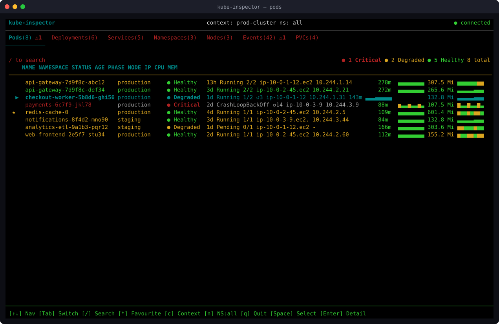
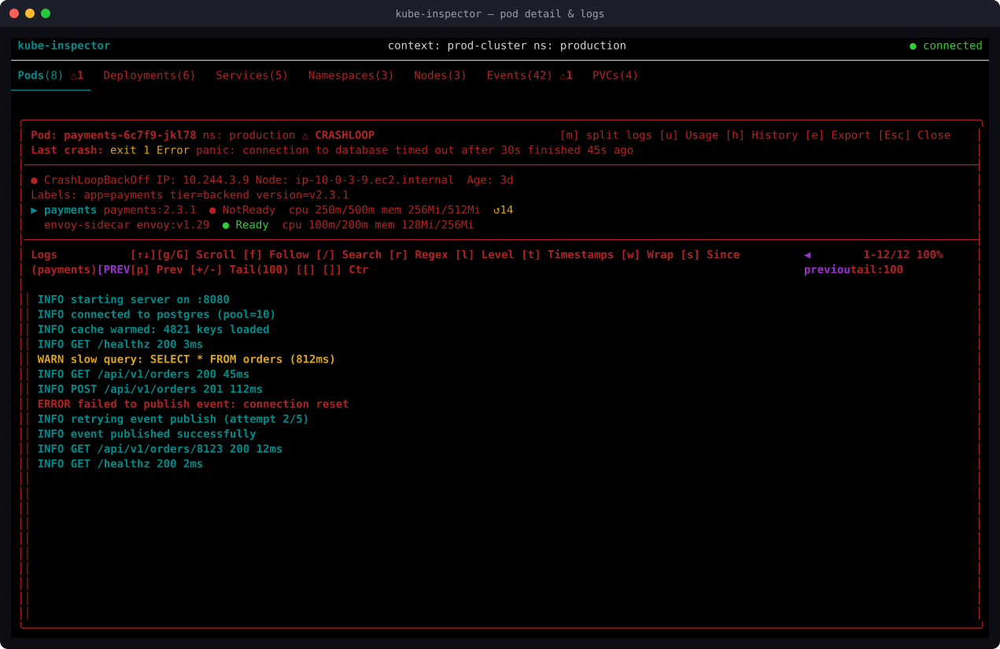
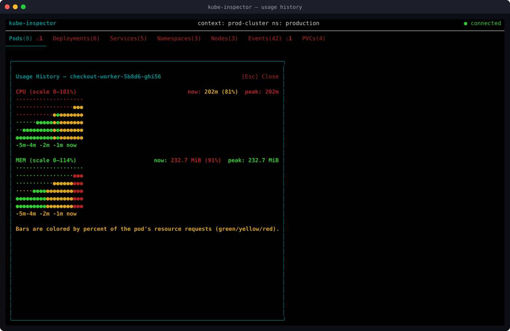

# kube-inspector

A Node.js TUI for inspecting and monitoring Kubernetes clusters in real-time — pods, deployments, services, nodes, and more, live in your terminal.

## Screenshots

**Pods view** — live health status, per-tab counts, CPU/mem usage with request-relative trend sparklines, favourites, and search.



**Pod detail & logs** — container statuses, crash drill-down, and a full-featured live log viewer with level/regex filtering.



**Usage history** — a bigger CPU/mem trend chart (up to 1 hour of history) for a single pod, colored by percent of its resource requests.



> These are generated from the app's real components with mock data (there's no live cluster to screenshot in this environment) — layout, colors, and behavior match what you'll see against a real cluster.

## Features

- Live watch of Pods, Deployments, Services, Namespaces, Nodes, Events, and PersistentVolumeClaims
- CPU/memory usage columns for Pods and Nodes via the metrics-server API (`kubectl top`-style), with a trend sparkline whose bars are colored by percent of the pod's own resource request (green/yellow/red) — not by the window's own peak, so a flat, healthy series stays visibly calm instead of looking "maxed out"; hidden automatically if metrics-server isn't installed or the terminal is too narrow
- A dedicated **Usage History** view per pod (`u` from the pod detail screen): a bigger multi-row trend chart with a time axis, holding up to 1 hour of session history
- Color-coded health status (🟢 green / 🟡 yellow / 🔴 red), including node pressure conditions (disk / memory / PID pressure)
- Per-tab resource counts and critical indicators in the tab bar
- Favourites — star any pod or node (`*`) to pin it; persisted to `~/.kube-inspector/favourites.json` across sessions
- Pop-up alerts on critical resource state transitions (auto-dismiss 5s, queue counter for multiple)
- Pod detail view with live log streaming, container-level status, crash drill-down, restart-history graph, and multi-pod log comparison
- Deployment rollout history with one-key rollback to any prior revision
- Context switching and namespace filtering with `/` search, without leaving the terminal
- Safe opt-in mutation support (delete, restart, scale, rollback) with mandatory confirmation and audit log
- Adaptive column widths that scale with terminal size
- Loading spinner and scroll progress indicator
- Context-aware footer hints that change based on active view

### Pod Log Features

- **Log level filtering** — cycle through ALL / ERROR / WARN / INFO with `l`; lines are color-coded (red / yellow / cyan) regardless of active filter
- **Regex search** — toggle regex mode with `r` before or during `/` search; invalid patterns degrade gracefully
- **Timestamp toggle** — `t` shows or hides the RFC3339 timestamp prefix without restarting the stream
- **Line wrap toggle** — `w` switches between truncate and full-wrap mode
- **Tail size control** — `+` / `-` cycles the initial fetch window (50 / 100 / 200 / 500 lines)
- **Since filter** — `s` cycles recency filters: all / last 5 m / 15 m / 1 h
- **Previous container logs** — `p` streams logs from the last-terminated container instance (crash-loop debugging)
- **Log export** — `e` writes the current buffer to `~/kube-inspector-logs/`
- **Multi-container split view** — `m` shows all containers side-by-side, auto-following
- **Dynamic height** — log panes expand to fill the terminal rather than using a fixed line count

## Requirements

- Node.js 20+
- A valid `~/.kube/config` with at least one context

## Usage

```bash
npm install

# Read-only mode (default)
npm start

# With mutations enabled
npm start -- --enable-mutations

# Custom max replica cap (default: 20)
npm start -- --enable-mutations --max-replicas=10
```

## Keyboard Controls

| Key            | Action                               |
| -------------- | ------------------------------------ |
| `Tab`          | Switch to next resource tab          |
| `↑` / `↓`      | Navigate rows                        |
| `Enter`        | Open detail view (pod logs for pods, rollout history for deployments) |
| `Space`        | Select pod (for multi-pod log view)  |
| `/`            | Search / filter rows                 |
| `*`            | Toggle favourite on the selected row |
| `c`            | Switch kubeconfig context            |
| `n`            | Filter by namespace                  |
| `Esc`          | Dismiss alert / close detail / clear search |
| `q` / `Ctrl+C` | Quit                                 |

### Pod Detail View

| Key         | Action                                                   |
| ----------- | -------------------------------------------------------- |
| `↑` / `↓`  | Scroll log                                               |
| `g` / `G`  | Jump to top / bottom                                     |
| `f`         | Toggle follow mode                                       |
| `/`         | Search log lines                                         |
| `r`         | Toggle regex search mode                                 |
| `l`         | Cycle log level filter (ALL → ERROR → WARN → INFO)       |
| `t`         | Toggle timestamp display                                 |
| `w`         | Toggle line wrap                                         |
| `s`         | Cycle since filter (all → 5 m → 15 m → 1 h)             |
| `p`         | Toggle previous container logs (crash-loop debugging)    |
| `+` / `-`   | Increase / decrease initial tail size (50/100/200/500)   |
| `[` / `]`  | Switch active container                                  |
| `m`         | Toggle split-pane view (multi-container pods)            |
| `u`         | Open Usage History graph (CPU/mem trend, up to 1h)       |
| `h`         | Open restart-history graph                                |
| `e`         | Export current log buffer to file                        |
| `Esc`       | Close current view                                        |

### Multi-pod Log View

| Key              | Action                                    |
| ---------------- | ------------------------------------------ |
| `←` / `→` / `h` / `l` | Move focus between pod panes        |
| `↑` / `↓`        | Scroll focused pane                       |
| `L` (Shift+L)    | Cycle log level filter across all panes   |
| `Esc`            | Return to resource table                  |

### Deployment Detail View (Rollout History)

| Key         | Action                                |
| ----------- | -------------------------------------- |
| `↑` / `↓`  | Select revision                        |
| `r` / `Enter` | Roll back to the selected revision  |
| `Esc`       | Close detail view                      |

### Mutations (requires `--enable-mutations`)

| Key       | Action                                      |
| --------- | -------------------------------------------- |
| `d`       | Delete selected pod, deployment, or service |
| `Shift+D` | Force-delete stuck pod (grace period = 0)   |
| `Shift+R` | Rollout restart selected deployment         |
| `s`       | Scale selected deployment                    |

## Safety — Mutations Mode

All mutations require explicit `y` confirmation. No action is ever triggered automatically.

- Protected namespaces (`prod`, `production`, `kube-system`) show a red `[PRODUCTION]` warning on the confirmation dialog
- `kube-system` resources cannot be mutated regardless of flags
- Scale is capped at 20 replicas by default (override with `--max-replicas=N`)
- Every mutation attempt is appended to `~/.kube-inspector/audit.log` with timestamp, action, resource, namespace, and result

## Development

```bash
npm test           # Run all tests (87 tests, 12 files)
npm run test:watch # Watch mode
npm run build      # Compile TypeScript to dist/
```

## Project Structure

```
src/
├── index.tsx              # CLI entry — parses args, renders App, manages alt-screen buffer
├── App.tsx                # Root component — state, routing, key bindings
├── hooks/
│   ├── useKubeClient.ts   # Loads kubeconfig, exposes context switching
│   ├── useResources.ts    # Watch-based live resource state (reconnects on disconnect)
│   ├── useLogStream.ts    # Streams pod logs into a ring buffer (last 500 lines); supports timestamps, previous, sinceSeconds, tailLines
│   ├── useAlerts.ts       # Derives alerts from critical state transitions
│   ├── useFavourites.ts   # Persists favourited resource UIDs to ~/.kube-inspector/favourites.json
│   ├── useRestartHistory.ts # Tracks per-container restart counts over the session for the restart graph
│   └── useMetrics.ts      # Polls metrics.k8s.io (metrics-server) for pod/node CPU+memory usage and history (up to 1h)
├── components/
│   ├── ResourceTable.tsx  # Scrollable table with search, adaptive columns, spinner, progress bar, CPU/MEM columns
│   ├── StatusBadge.tsx    # Color-coded ● health indicator
│   ├── NavTabs.tsx        # Tab bar with resource count badges and critical indicators
│   ├── AlertBanner.tsx    # Critical alert banner with queue counter, auto-dismisses after 5s
│   ├── ConfirmModal.tsx   # Mutation confirmation overlay — never self-triggers
│   ├── ScaleModal.tsx     # Replica stepper for deployment scaling — hands off to ConfirmModal
│   ├── ContextSwitcher.tsx# Kubeconfig context switcher with / search filter
│   ├── NamespacePicker.tsx# Namespace filter picker with / search filter
│   ├── PodDetail.tsx      # Pod detail: container statuses + full-featured log view
│   ├── SplitLogView.tsx   # Side-by-side log comparison for multi-container pods
│   ├── MultiPodLogView.tsx# Multi-pod log view for 2+ selected pods; dynamic height
│   ├── RestartGraph.tsx   # Per-container restart-count sparkline and crash history
│   ├── UsageGraph.tsx     # Multi-row CPU/mem trend chart with time axis, per-pod
│   └── DeploymentDetail.tsx# Rollout history with one-key rollback to a prior revision
└── utils/
    ├── health.ts          # Pure functions: classify resource health
    ├── format.ts          # Pure functions: format age/durations
    ├── logLevel.ts        # Shared log level types, keywords, color, filter helpers
    ├── metrics.ts         # Pure functions: parse/format CPU+memory quantities, usage color thresholds, request-relative sparkline segments
    ├── sparkline.ts       # Renders a number series as a Unicode block trend line
    └── mutate.ts          # Only file that calls k8s write APIs — always audits
```
